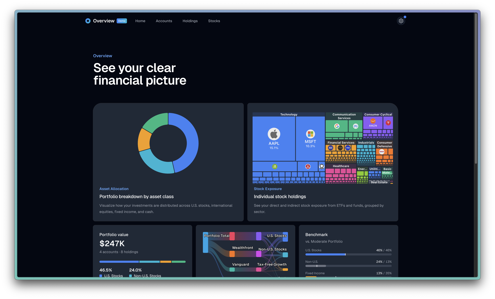

# Portfolio Overview

A modern portfolio management dashboard built with Next.js 15, Tremor Raw, and Highcharts. Track accounts, holdings, and analyze portfolio exposure across asset classes, sectors, and individual stocks through rich interactive visualizations.

## Capstone Project Information

|                               |                      |
| ----------------------------- | -------------------- |
| **Title of Capstone Project** | Portfolio Overview   |
| **Full Name**                 | Douglas O. Sanchez   |
| **HES ID**                    | 31473772             |
| **Graduate Degree Program**   | Digital Media Design |
| **Email Address**             | dos707@g.harvard.edu |
| **Date**                      | 12/17/2025           |

---

## Abstract

Individual investors increasingly hold diversified portfolios across multiple brokerage accounts, often including Exchange-Traded Funds (ETFs) that obscure true underlying stock exposure. This project addresses the challenge of understanding actual portfolio composition by developing a comprehensive portfolio analysis application. Built with Next.js 15, TypeScript, and advanced visualization libraries (Highcharts, Recharts, Nivo), the application implements ETF look-through analysis to reveal hidden stock concentrations within fund holdings. The architecture prioritizes user privacy through a client-side-only data model, storing all portfolio information locally without server-side persistence. Key features include multi-account management with institution branding, real-time price updates via Alpha Vantage API, and interactive visualizations including treemaps, sunburst charts, and Sankey diagrams for intuitive exposure analysis. The responsive, mobile-first design ensures accessibility across devices. This capstone project demonstrates proficiency in modern React patterns, complex state management, third-party API integration, and data visualization best practices while solving a practical problem for self-directed investors seeking deeper portfolio insights.

---



## Table of Contents

- [Features](#features)
- [Tech Stack](#tech-stack)
- [Getting Started](#getting-started)
- [Architecture](#architecture)
- [Design System](#design-system)
- [State Management](#state-management)
- [API Routes](#api-routes)
- [Storage Patterns](#storage-patterns)
- [Charts & Visualizations](#charts--visualizations)
- [Development Patterns](#development-patterns)
- [License](#license)

---

## Features

### Portfolio Management

- **Multi-Account Support**: Manage multiple brokerage accounts with institution branding
- **Holdings Tracking**: Track stocks, ETFs, mutual funds, and cash positions
- **Real-time Price Updates**: Auto-updating stock prices via Alpha Vantage API (5-minute polling)
- **Cross-tab Synchronization**: Changes sync across browser tabs automatically
- **Demo Mode**: Toggle demo data for showcasing without exposing personal portfolio

### Exposure Analysis

- **Asset Class Allocation**: Visualize distribution across U.S. stocks, international stocks, fixed income, and cash
- **Sector Exposure**: Break down holdings by market sector with ETF look-through
- **Institution Exposure**: See allocation across brokerage accounts
- **Concentration Risk**: Identify single-stock concentration risks

### Interactive Visualizations

- **Treemaps**: Hierarchical portfolio views by sector and holding
- **Sunburst Charts**: Multi-level drill-down into ETF compositions
- **Sankey Diagrams**: Flow visualization from accounts to asset classes
- **Donut Charts**: Asset allocation summaries
- **Category Bars**: Proportional breakdowns with interactive legends

### Dashboard Pages

| Page         | Description                                                             |
| ------------ | ----------------------------------------------------------------------- |
| **Overview** | Portfolio summary with key metrics, asset allocation, and quick actions |
| **Accounts** | Manage brokerage accounts with institution logos and account types      |
| **Holdings** | Full holdings table with filtering, sorting, and CRUD operations        |
| **Exposure** | Deep-dive into portfolio allocation analysis with multiple chart types  |
| **Showcase** | Demo presentation mode for showcasing the application                   |

---

## Tech Stack

| Category          | Technology                                                                                               |
| ----------------- | -------------------------------------------------------------------------------------------------------- |
| **Framework**     | [Next.js 15](https://nextjs.org) with App Router                                                         |
| **Language**      | TypeScript (strict mode)                                                                                 |
| **UI Components** | [Tremor Raw](https://tremor.so) (built on [Radix UI](https://www.radix-ui.com))                          |
| **Styling**       | [Tailwind CSS 3.4](https://tailwindcss.com) with [tailwind-variants](https://www.tailwind-variants.org/) |
| **Charts**        | [Recharts](https://recharts.org), [Highcharts](https://www.highcharts.com), [Nivo](https://nivo.rocks)   |
| **Tables**        | [TanStack Table v8](https://tanstack.com/table)                                                          |
| **Validation**    | [Zod](https://zod.dev)                                                                                   |
| **Icons**         | [Remix Icons](https://remixicon.com) via `@remixicon/react`                                              |
| **Theme**         | Dark mode support via [next-themes](https://github.com/pacocoursey/next-themes)                          |
| **React**         | React 19                                                                                                 |

### Key Dependencies

```json
{
  "next": "15.5.7",
  "react": "19.0.0",
  "highcharts": "^12.4.0",
  "recharts": "^2.15.1",
  "@nivo/treemap": "^0.99.0",
  "@nivo/sankey": "^0.99.0",
  "@tanstack/react-table": "^8.21.2",
  "tailwind-variants": "^0.3.1",
  "zod": "^3.24.2"
}
```

---

## Getting Started

### Prerequisites

- Node.js 18.17 or later
- pnpm (recommended) or npm

### Installation

```bash
# Clone the repository
git clone https://github.com/your-username/overview.git
cd overview

# Install dependencies
pnpm install

# Start development server
pnpm run dev

# Open http://localhost:3000
```

### Environment Variables

Create a `.env.local` file for API integrations:

```env
# Alpha Vantage API for real-time stock prices (optional)
ALPHA_VANTAGE_API_KEY=your_api_key_here
```

Without an API key, the app uses mock price data for development.

### Available Scripts

| Command                     | Description                    |
| --------------------------- | ------------------------------ |
| `pnpm dev`                  | Start development server       |
| `pnpm build`                | Build for production           |
| `pnpm start`                | Start production server        |
| `pnpm lint`                 | Run ESLint                     |
| `pnpm generate:agents`      | Generate agent mock data       |
| `pnpm generate:workflow`    | Generate workflow mock data    |
| `pnpm generate:support`     | Generate support ticket data   |
| `pnpm generate:retention`   | Generate retention cohort data |
| `pnpm generate:screenshots` | Generate marketing screenshots |

---

## Architecture

### Directory Structure

```
src/
├── app/                          # Next.js App Router
│   ├── (dashboard)/              # Dashboard pages (grouped route)
│   │   ├── overview/             # Portfolio overview
│   │   ├── accounts/             # Account management
│   │   ├── holdings/             # Holdings table
│   │   ├── exposure/             # Exposure analysis
│   │   ├── showcase/             # Demo presentation
│   │   ├── analysis/             # Additional analysis
│   │   ├── agents/               # Agent management (template)
│   │   ├── workflow/             # Workflow management (template)
│   │   ├── support/              # Support tickets (template)
│   │   └── retention/            # Retention cohorts (template)
│   ├── api/                      # Serverless API routes
│   │   ├── stock-price/          # Stock price lookups
│   │   ├── etf-data/             # ETF composition data
│   │   ├── etf-metadata/         # ETF metadata
│   │   ├── etf-holdings/         # ETF holdings lookup
│   │   ├── company-overview/     # Company profiles
│   │   ├── symbol-search/        # Ticker search
│   │   └── logo-url/             # Logo URL validation
│   ├── login/                    # Authentication page
│   ├── layout.tsx                # Root layout with providers
│   └── globals.css               # Global styles
│
├── components/                   # React components
│   ├── ui/                       # Shared UI components
│   │   ├── AccountSelector.tsx   # Account dropdown selector
│   │   ├── AccountDrawer.tsx     # Account edit drawer
│   │   ├── HoldingsDrawer.tsx    # Holdings edit drawer
│   │   ├── InstitutionLogo.tsx   # Logo with fallback
│   │   ├── TickerLogo.tsx        # Ticker logo component
│   │   ├── Navigation.tsx        # Main navigation
│   │   └── data-table-*/         # Table components
│   │
│   ├── Button.tsx                # Button component
│   ├── Badge.tsx                 # Badge component
│   ├── Card.tsx                  # Card component
│   ├── Dialog.tsx                # Modal dialog
│   ├── Drawer.tsx                # Slide-out drawer
│   ├── Select.tsx                # Select dropdown
│   ├── Input.tsx                 # Text input
│   ├── Tabs.tsx                  # Tab navigation
│   │
│   ├── LineChart.tsx             # Recharts line chart
│   ├── DonutChart.tsx            # Recharts donut chart
│   ├── CategoryBar.tsx           # Proportional bar chart
│   ├── ProgressCircle.tsx        # Circular progress
│   │
│   ├── AccountTreemap.tsx        # Nivo treemap
│   ├── HoldingsSunburst.tsx      # Highcharts sunburst
│   ├── SankeyChartHighcharts.tsx # Highcharts Sankey
│   └── HighchartsDonutChart.tsx  # Highcharts donut
│
├── hooks/                        # Custom React hooks
│   ├── usePortfolioStore.ts      # Central state management
│   └── useExposureCalculations.ts # Exposure analysis
│
├── lib/                          # Utilities and services
│   ├── utils.ts                  # Core utilities (cx, focusRing)
│   ├── chartUtils.ts             # Chart color palette
│   ├── assetClassColors.ts       # Asset class color config
│   ├── institutionUtils.ts       # Institution helpers
│   ├── logoUtils.ts              # Logo fetching utilities
│   ├── formatters.ts             # Number/date formatters
│   ├── localStorage.ts           # Versioned storage
│   ├── indexedDBBackup.ts        # IndexedDB backup
│   ├── stockPriceService.ts      # Stock price client
│   ├── etfDataService.ts         # ETF data client
│   ├── etfMetadataService.ts     # ETF metadata client
│   ├── exposureCalculator.ts     # Basic exposure calc
│   ├── enhancedExposureCalculator.ts # Advanced exposure
│   └── alphaVantage.ts           # Alpha Vantage API
│
└── data/                         # Data schemas and generators
    ├── agents/                   # Agent data
    ├── workflow/                 # Workflow data
    ├── support/                  # Support tickets
    ├── retention/                # Retention cohorts
    └── stock-prices/             # Cached price data
```

### Key Architectural Patterns

1. **App Router**: Next.js 15 App Router with grouped routes for dashboard sections
2. **Client Components**: Interactive components marked with `"use client"` directive
3. **Server Components**: Static layouts and data fetching where possible
4. **API Routes**: Serverless functions for external API proxying and caching

---

## Design System

### Color Palette

The design system uses Tailwind CSS colors with semantic mapping for consistency across light and dark modes.

#### Chart Colors

Defined in `src/lib/chartUtils.ts`:

| Color   | Tailwind Class | Usage                |
| ------- | -------------- | -------------------- |
| Blue    | `blue-500`     | Primary, U.S. Stocks |
| Cyan    | `cyan-500`     | Non-U.S. Stocks      |
| Emerald | `emerald-500`  | Cash, Success states |
| Amber   | `amber-500`    | Fixed Income         |
| Violet  | `violet-500`   | Alternative assets   |
| Rose    | `rose-500`     | Real Estate          |
| Gray    | `gray-500`     | Other, Neutral       |

#### Asset Class Colors

Centralized in `src/lib/assetClassColors.ts`:

```typescript
const ASSET_CLASS_COLORS = {
  "U.S. Stocks": "blue",
  "Non-U.S. Stocks": "cyan",
  "Fixed Income": "amber",
  Cash: "emerald",
  "Real Estate": "rose",
  Commodities: "orange",
  Alternative: "violet",
  Other: "gray",
}
```

**Hex values for Highcharts:**

- U.S. Stocks: `#3b82f6`
- Non-U.S. Stocks: `#06b6d4`
- Fixed Income: `#f59e0b`
- Cash: `#10b981`

### Typography

- **Font**: Geist Sans (auto-optimized via `next/font`)
- **Headings**: `font-semibold` or `font-bold`
- **Body**: `text-sm` (14px) default, `text-xs` (12px) for secondary
- **Colors**: `text-gray-900 dark:text-gray-50` for primary text

### Component Variants

Components use `tailwind-variants` for type-safe variant management.

#### Button Variants

```typescript
// src/components/Button.tsx
const buttonVariants = tv({
  base: "rounded-md... inline-flex items-center justify-center",
  variants: {
    variant: {
      primary: "bg-blue-600 text-white hover:bg-blue-700",
      secondary: "border-gray-300 bg-white hover:bg-gray-50",
      light: "bg-gray-200 hover:bg-gray-300/70",
      ghost: "bg-transparent hover:bg-gray-100",
      destructive: "bg-red-600 text-white hover:bg-red-700",
    },
  },
})
```

#### Badge Variants

```typescript
// src/components/Badge.tsx
const badgeVariants = tv({
  variants: {
    variant: {
      default: "bg-blue-50 text-blue-900 ring-blue-500/30",
      neutral: "bg-gray-50 text-gray-900 ring-gray-500/30",
      success: "bg-emerald-50 text-emerald-900 ring-emerald-600/30",
      error: "bg-red-50 text-red-900 ring-red-600/20",
      warning: "bg-yellow-50 text-yellow-900 ring-yellow-600/30",
    },
  },
})
```

### Utility Functions

#### `cx()` - Class Name Merger

Combines `clsx` and `tailwind-merge` for safe class composition:

```typescript
import { cx } from "@/lib/utils"

className={cx(
  "base-classes",
  "dark:dark-mode-classes",
  isActive && "conditional-classes",
  className, // Override-safe
)}
```

#### Focus Ring Utilities

```typescript
// Focus states for accessibility
export const focusRing = [
  "outline outline-offset-2 outline-0 focus-visible:outline-2",
  "outline-blue-500 dark:outline-blue-500",
]

export const focusInput = [
  "focus:ring-2",
  "focus:ring-blue-200 focus:dark:ring-blue-700/30",
  "focus:border-blue-500 focus:dark:border-blue-700",
]
```

### Dark Mode

Implemented via `next-themes` with class-based switching:

```typescript
// tailwind.config.ts
darkMode: "class"
```

**Pattern for components:**

```typescript
className={cx(
  "text-gray-900 dark:text-gray-50",
  "bg-white dark:bg-gray-950",
  "border-gray-200 dark:border-gray-800",
)}
```

### Animations

Custom animations defined in `tailwind.config.ts`:

| Animation                | Usage                     |
| ------------------------ | ------------------------- |
| `dialogOverlayShow`      | Modal overlay fade-in     |
| `dialogContentShow`      | Modal content scale-in    |
| `drawerSlideLeftAndFade` | Drawer slide from right   |
| `bottomSheetSlideUp`     | Mobile bottom sheet       |
| `accordionOpen/Close`    | Accordion expand/collapse |

---

## State Management

### `usePortfolioStore` Hook

The central state management hook (`src/hooks/usePortfolioStore.ts`) provides:

#### State

- `accounts` - Array of brokerage accounts
- `holdings` - Array of holdings across all accounts
- `isLoading` - Loading state
- `error` - Error state
- `isDemoMode` - Demo data toggle
- `dataVersion` - Cache invalidation counter

#### Account Operations

```typescript
addAccount(account: Omit<Account, "id" | "totalValue" | "holdingsCount" | "assetAllocation">)
updateAccount(id: string, updates: Partial<Account>)
deleteAccount(id: string)
```

#### Holdings Operations

```typescript
addHolding(holding: Omit<Holding, "id" | "allocation">)
updateHolding(id: string, updates: Partial<Holding>)
deleteHolding(id: string)
getHoldingsByAccount(accountId: string)
```

#### Calculated Values

```typescript
totalPortfolioValue: number
portfolioAllocation: {
  usStocks, nonUsStocks, fixedIncome, cash
}
```

#### Utility Functions

```typescript
clearAllData()
resetToDefaults()
updatePrices()
refreshETFNames()
exportPortfolioData()
importPortfolioData(data)
```

### `useExposureCalculations` Hook

Provides memoized exposure analysis (`src/hooks/useExposureCalculations.ts`):

```typescript
const {
  exposures,           // Stock-level exposure data
  totalValue,          // Total portfolio value
  assetClassBreakdown, // By asset class
  sectorBreakdown,     // By sector
  treemapData,         // For treemap visualization
  isCalculating,       // Loading state
  error,               // Error state
  getTopExposures(limit),
  checkConcentrationRisk(ticker, additionalValue),
} = useExposureCalculations()
```

### Type Definitions

```typescript
interface Account {
  id: string
  name: string
  accountType: string
  accountTypeLabel: string
  institution: string
  institutionLabel: string
  totalValue: number
  holdingsCount: number
  assetAllocation: {
    usStocks: number
    nonUsStocks: number
    fixedIncome: number
    cash: number
  }
}

interface Holding {
  id: string
  accountId: string
  accountName: string
  ticker?: string
  name: string
  quantity: number
  lastPrice: number
  marketValue: number
  allocation: number
  type: "stock" | "fund" | "cash"
  isManualEntry?: boolean
  sector?: string
  industry?: string
}
```

---

## API Routes

### Stock Price API

**Endpoint:** `POST /api/stock-price`

Fetches stock prices with multi-layer caching:

```typescript
// Request
{ symbols: ["AAPL", "MSFT", "VTI"] }

// Response
{
  "AAPL": {
    lastPrice: 234.56,
    previousClose: 232.89,
    changePercent: 0.72,
    changeAmount: 1.67,
    volume: 67890123
  }
}
```

**Caching Strategy:**

1. Memory cache (15 minutes)
2. File cache (24 hours)
3. Alpha Vantage API (rate-limited)
4. Mock data fallback

### ETF Data API

**Endpoint:** `POST /api/etf-data`

Returns ETF composition and holdings data for exposure calculations.

### ETF Metadata API

**Endpoint:** `POST /api/etf-metadata`

Returns ETF names, descriptions, and classification.

### Logo URL API

**Endpoint:** `POST /api/logo-url`

Validates and caches logo URLs from logo.dev:

```typescript
// Uses logo.dev API
;`https://img.logo.dev/${domain}?token=${token}&size=128`
```

---

## Storage Patterns

### Layered Storage Strategy

Portfolio data uses a resilient layered approach:

```
Priority (highest to lowest):
LocalStorage (primary) → IndexedDB (backup) → Default data (fallback)
```

### Versioned Storage

All localStorage operations use versioned wrappers (`src/lib/localStorage.ts`):

```typescript
interface StorageData<T> {
  version: string
  data: T
  timestamp: number
}

// Usage
import { getFromStorage, setToStorage, STORAGE_KEYS } from "@/lib/localStorage"

const accounts = getFromStorage<Account[]>(STORAGE_KEYS.accounts)
setToStorage(STORAGE_KEYS.accounts, accounts)
```

### IndexedDB Backup

Automatic backup to IndexedDB (`src/lib/indexedDBBackup.ts`):

```typescript
import {
  saveBackupToIndexedDB,
  getLatestBackupFromIndexedDB,
  getBackupAge,
} from "@/lib/indexedDBBackup"
```

### Cross-Tab Synchronization

Storage events enable cross-tab state sync:

```typescript
// Listen for changes from other tabs
window.addEventListener("storage", handleStorageChange)

// Custom event for same-tab sync
window.dispatchEvent(
  new CustomEvent("portfolio-state-update", {
    detail: { accounts, holdings },
  }),
)
```

---

## Charts & Visualizations

### Recharts (Declarative)

Used for simpler charts with React-friendly API:

```typescript
import { LineChart, DonutChart, CategoryBar } from "@/components"

<CategoryBar
  data={assetClassData}
  colors={["blue", "cyan", "amber", "emerald"]}
/>
```

### Highcharts (Advanced)

Used for complex visualizations (sunburst, Sankey):

**Important: Module Loading Pattern**

```typescript
"use client"

import Highcharts from "highcharts"
import HighchartsReact from "highcharts-react-official"
import HighchartsSunburst from "highcharts/modules/sunburst"

// Initialize only when Highcharts is loaded as an object
if (typeof Highcharts === "object") {
  if (typeof HighchartsSunburst === "function") {
    HighchartsSunburst(Highcharts)
  }
}
```

**DO NOT:**

```typescript
// Wrong - ES6 side-effect imports
import "highcharts/modules/sunburst"

// Wrong - Direct call without checks
HighchartsSunburst(Highcharts)
```

### Nivo (D3-based)

Used for treemaps with smooth animations:

```typescript
import { ResponsiveTreeMap } from "@nivo/treemap"

<ResponsiveTreeMap
  data={treemapData}
  identity="name"
  value="value"
  // ...
/>
```

### Hydration Pattern

For charts requiring DOM access:

```typescript
const [isClient, setIsClient] = React.useState(false)

React.useEffect(() => {
  setIsClient(true)
}, [])

if (!isClient) {
  return <LoadingPlaceholder />
}

return <ChartComponent />
```

---

## Development Patterns

### Component Structure

All components use TypeScript with explicit interfaces and `forwardRef`:

```typescript
interface ComponentProps
  extends React.ComponentPropsWithoutRef<"div">,
    VariantProps<typeof variants> {
  customProp?: string
}

const Component = React.forwardRef<HTMLDivElement, ComponentProps>(
  ({ className, variant, customProp, ...props }, ref) => {
    return (
      <div
        ref={ref}
        className={cx(variants({ variant }), className)}
        {...props}
      />
    )
  }
)

Component.displayName = "Component"
export { Component, type ComponentProps }
```

### TanStack Table Pattern

```typescript
// types.ts - Define interfaces
interface ColumnData {
  /* ... */
}

// columns.tsx - Column definitions
export const createColumns = ({ onEdit, onDelete }) => [
  columnHelper.accessor("name", {
    /* ... */
  }),
]

// Table.tsx - Main component
const columns = React.useMemo(
  () => createColumns({ onEdit, onDelete }),
  [onEdit, onDelete],
)
```

### Image Best Practices

For retina displays, fetch higher resolution than display size:

```typescript
<Image
  src={logoUrl}
  alt="Logo"
  width={48}    // Fetch 48x48px (2x for retina)
  height={48}
  className="size-6"  // Display at 24x24px
/>
```

### Path Aliases

```typescript
// tsconfig.json
{
  "compilerOptions": {
    "paths": {
      "@/*": ["./src/*"]
    }
  }
}

// Usage
import { Button } from "@/components/Button"
import { cx } from "@/lib/utils"
```

---

## License

Copyright (c) 2025 Douglas O. Sanchez. All rights reserved.

This source code is provided for viewing and educational purposes only. See [LICENSE.md](LICENSE.md) for details.

---

## Learn More

- [Tremor Raw](https://tremor.so) - Component library documentation
- [Next.js](https://nextjs.org/docs) - Framework documentation
- [Tailwind CSS](https://tailwindcss.com) - Utility-first CSS framework
- [Radix UI](https://www.radix-ui.com) - Accessible component primitives
- [Recharts](https://recharts.org) - Composable charting library
- [Highcharts](https://www.highcharts.com) - Advanced visualization library
- [Nivo](https://nivo.rocks) - D3-based React charts
- [TanStack Table](https://tanstack.com/table) - Headless table library

---

## Contributing

1. Fork the repository
2. Create a feature branch (`git checkout -b feature/amazing-feature`)
3. Commit changes (`git commit -m 'Add amazing feature'`)
4. Push to branch (`git push origin feature/amazing-feature`)
5. Open a Pull Request

---

## Acknowledgments

- [Tremor](https://tremor.so) for the beautiful dashboard template foundation
- [Vercel](https://vercel.com) for Next.js and deployment platform
- [Alpha Vantage](https://www.alphavantage.co) for ETF holdings and stock price API
- [logo.dev](https://logo.dev) for company logo API
- [Claude Code](https://claude.ai/code) for AI-assisted development
- [GitHub Copilot](https://github.com/features/copilot) for commit message summaries
